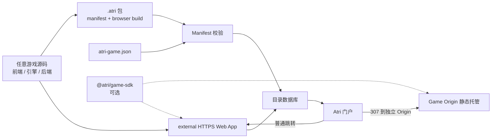
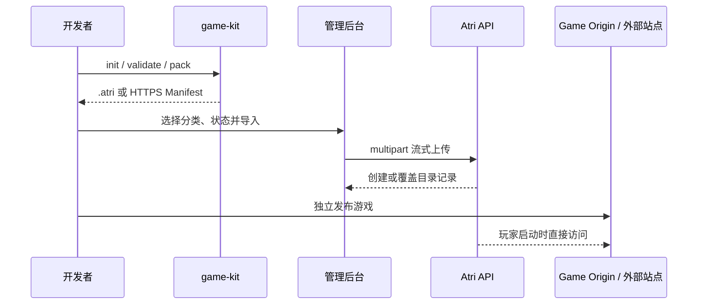

# Atri Games 架构说明

## 1. 目标与边界

Atri Games 是目录、发行入口和可选平台能力提供方。游戏可以使用任意前端框架、引擎、服务端语言、数据库、实时协议或第三方服务；平台不要求开发者改写游戏主循环，也不执行未知语言的服务端源码。

接入契约只有一份 `atri-game.json`：

- `runtime.kind=external`：填写已经部署的 HTTPS 游戏入口，适合 SSR、Python/Go/Java/Node 后端、WebSocket 和自定义基础设施。
- `runtime.kind=static`：上传 `.atri` 包，包内包含浏览器构建产物；适合 Unity Web、Godot Web、Wasm、Canvas、React/Vue、纯 HTML 等。

SDK 是可选的生命周期桥接，不是收录前置条件。默认启动会卸载门户页面，让浏览器的 CPU、GPU、内存和网络优先服务游戏。

## 2. 总体架构



门户、API、静态包托管和游戏后端分别发版。门户不会把 Token、用户邮箱或私有 DOM 参数拼进启动 URL。

## 3. 游戏包规范

```text
my-game.atri (ATRIENC1 加密容器)
└── 经认证加密的 ZIP 负载
    ├── atri-game.json
    ├── cover.webp
    ├── screenshots/...
    └── game/                  # 仅 static 模式需要
        ├── index.html
        ├── assets/
        └── ...
```

`runtime.entry` 相对于 `game/`。静态构建建议使用相对资源路径，或把构建 base 配置为 `/playables/<id>/`；CLI 会对根相对引用给出提示。带后端的项目不打包服务端，改用：

```json
{
  "runtime": {
    "kind": "external",
    "url": "https://game.example.com/play",
    "openIn": "same-tab"
  }
}
```

导入器只写入 `/assets/playables/<id>/` 和 `/assets/covers/<id>/`，不执行包内脚本。它流式接收文件，先在私有临时空间认证并解密新 `.atri` 容器，再限制压缩包大小、解压后总大小和文件数量，拒绝路径穿越、重复路径和符号链接。安装清单与 SQLite 事务一起使用，进程在双写之间中断时启动恢复会自动回滚或完成清理。

CLI 先使用无依赖的 store-only ZIP 写入器，避免对已经压缩的纹理、音频和引擎产物重复消耗 CPU；随后以随机 AES-256-GCM 内容密钥加密 ZIP，并用平台 RSA-OAEP-SHA256 公钥封装该密钥。服务端以私钥认证、解密并继续沿用 ZIP 校验；历史普通 ZIP 仍兼容导入。这个机制防止上传归档被简单改后缀查看，但浏览器为运行游戏仍会下载已发布的静态资源，绝不应把密钥或服务端源码放进游戏包。Game Origin 不做动态压缩，只为 Unity 常见的 Brotli/Gzip 预压缩 `.wasm`、`.js` 与 `.data` 文件补齐响应头，把 CPU 留给浏览器里的游戏循环。

## 4. Origin 隔离与启动

门户站点负责 `/api/*`、目录页面和展示媒体。静态包的 `/playables/*` 在门户 Origin 上只做 307 重定向，再由 `ATRI_GAME_SITE_ADDRESS` 对应的 Game Origin 从只读资源卷提供。这样游戏无法读取门户的 `atri_user_token` 或管理会话，也不需要 iframe、通用 Runner 或特定 CSP。

游戏详情页先调用启动接口记录一次播放事件，再依据 `runtime.openIn` 使用当前标签页或新标签页打开。新标签页使用 `noopener,noreferrer`；弹窗被浏览器阻止时回退到当前标签页。

## 5. 可选 SDK

`@atri/game-sdk` 为零依赖浏览器包，提供：

- `ready()`：报告入口完成加载；
- `on("pause"|"resume")`：监听页面可见性；
- `progress()`、`score()`：发送可选宿主消息；
- `fullscreen()`、`exitFullscreen()`、`exit()`：通用浏览器行为。

没有宿主或没有安装 SDK 时，方法退化为本地行为或空操作，游戏仍可独立运行。SDK 不接管渲染、网络、存档和引擎。

## 6. 宿主轻量化

- React 目录路由按需懒加载；封面使用 `loading="lazy"` 与异步解码。
- 启动游戏后门户页面直接卸载，不在后台保留渲染循环或游戏 iframe。
- Caddy 只读提供静态文件，API 负责流式上传和元数据，不把整个游戏包保存在内存。
- API、Caddy 使用明确的 CPU/内存上限；静态游戏的 CPU/GPU 工作发生在玩家浏览器。
- 资源卷与数据库独立持久化，镜像升级不会把已删除的游戏文件复制回来。

## 7. 平台代码结构

```text
Atri-Games/
├── apps/web/                 # React + Vite 玩家门户
├── apps/admin/               # React + Vite 管理后台
├── apps/api/                 # Go 模块化单体 API
│   └── internal/gamepkg/     # ZIP/Manifest 校验与安全解包
├── packages/shared/          # API 类型与客户端
├── packages/game-kit/        # npx @atri/game-kit
├── packages/game-sdk/        # 可选浏览器桥接
├── schemas/                  # 跨语言 JSON Schema
├── examples/                 # 可复制的清单示例
└── infra/                    # Compose、Dockerfile、Caddy
```

平台自身保持模块化单体与 SQLite；只有出现真实的扩缩容或故障隔离需求时才拆服务。外部游戏不加入 pnpm workspace。

## 8. 接入流程



详细字段和平台能力见 [Manifest Schema](../schemas/game-manifest.schema.json)、[game-kit](../packages/game-kit/README.md) 与 [平台集成说明](PLATFORM_INTEGRATION.md)。
