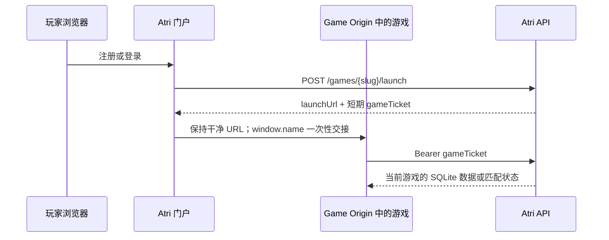

# Atri Games 平台集成

游戏是独立 Web 应用。基础收录支持已经部署的任意技术栈，也支持通过 `.atri` 上传浏览器静态构建；不要求 SDK。本文说明清单、包格式和可选平台能力。

## 最短路径：清单与 `.atri`

Manifest Schema 位于 [`schemas/game-manifest.schema.json`](../schemas/game-manifest.schema.json)。开发者可以使用零依赖 CLI：

```bash
npx @atri/game-kit init my-game
cd my-game
npx @atri/game-kit validate
npx @atri/game-kit pack --out my-game.atri
```

`runtime.kind=external` 只登记已部署的 HTTPS URL，适合带任意后端的项目；`runtime.kind=static` 把构建产物放入 `game/`。管理后台的“导入游戏包”会流式上传并校验路径、符号链接、文件数和大小，然后将静态文件放到独立 Game Origin。平台从不运行包内的服务端代码。

`@atri/game-sdk` 是可选的零依赖浏览器桥接。它提供加载就绪、可见性暂停/恢复、进度/成绩、全屏和退出消息；声明平台服务后还提供短期游戏票据、SQLite 数据和 HTTP 匹配队列封装。没有父宿主时全部退化为本地行为或空操作。游戏的渲染和引擎仍由游戏项目控制。

## 集成级别

| 级别 | 内容 | 游戏需要做什么 |
| --- | --- | --- |
| L0 | 目录、详情、启动链接 | 提交 Manifest 和 HTTPS URL |
| L1 | 统一玩家票据、SQLite 数据、内置匹配 | 在 `services.*` 中声明能力，使用 SDK 或 `/api/v1/games/<slug>/...` |
| L2 | 平台到游戏后端的异步事件 | 登记 Webhook URL 并验证签名 |

L1 和 L2 可以分别使用。纯单机游戏停留在 L0 即可；外部 URL 游戏停留在 L0 并继续使用自己的登录和数据库。

## 应用登记（后续扩展，当前未开放）

进阶集成通过开发者控制台登记，不写入公开 Manifest：

- `clientId` 与所属 `gameId`
- 精确允许的浏览器 Origins
- 精确允许的 OAuth 回调 URL
- 获准 Scopes
- Webhook URL、订阅事件与签名密钥
- 密钥状态、轮换时间和投递记录

浏览器代码不保存客户端密钥。只有游戏后端可以持有服务端凭据和 Webhook 签名密钥。

## 内置游戏票据流程

静态 `.atri` 游戏不需要实现 OAuth/OIDC。只有显式声明平台身份、SQLite 存档或内置匹配的游戏，启动接口才会为已登录玩家签发一个短期、带 `gameId`/`gameSlug`/Scope 的 JWT；票据通过一次性的 `window.name` 交接给 Game Origin，URL 不携带票据，平台 bootstrap 会在游戏脚本前读取并清空交接数据：



要求：

- 游戏票据只接受 `kind=game`、目标 `gameId`/`gameSlug` 和有效 `audience`，普通平台 JWT 不能调用游戏数据接口。
- 票据默认 15 分钟有效，可用 `ATRI_GAME_TICKET_TTL_SECONDS` 调整；SDK 会在到期前调用 `/ticket/refresh` 换取同 Scope 新票据。不要把票据写入自己的日志、存档或分析事件。
- Game Origin 的 `/api/v1/*` 已由 Caddy 代理到平台 API，SDK 默认使用相对地址。
- `services.storage` 的命名空间同时按游戏和玩家隔离；浏览器票据不提供全局共享写权限，外部游戏不会收到平台票据。

## 扩展 HTTPS API（规划，当前未开放）

建议从 `/v1` 开始，统一 JSON 错误结构和请求 ID。第一批资源：

- `identity.profile:read`
- `saves:read`、`saves:write`
- `achievements:read`、`achievements:write`
- `leaderboards:read`、`scores:submit`

写操作支持 `Idempotency-Key`。存档、成绩和成就按 `gameId` 隔离，单个游戏不能请求其他游戏的数据。客户端提交的排行榜成绩需要单独设计可信验证，不能只依赖浏览器声明。

游戏调用自己的 API、WebSocket 或第三方服务不经过 Atri API，也不需要在这里登记。

## Webhook（规划，当前未开放）

Webhook 是 Atri 服务端发送给游戏服务端的 HTTPS POST。示例事件：

```json
{
  "id": "evt_EVENT_ID",
  "type": "competition.season.closed",
  "createdAt": "2026-07-27T10:00:00Z",
  "gameId": "example-puzzle",
  "data": {}
}
```

建议请求头：

```text
Atri-Webhook-Id: evt_EVENT_ID
Atri-Webhook-Timestamp: 1785146400
Atri-Webhook-Signature: v1=HEX_HMAC_SHA256
```

签名原文使用 `eventId.timestamp.rawBody`，通过游戏专属密钥计算 HMAC-SHA256。接收方必须：

1. 使用原始请求体校验签名，并使用恒定时间比较。
2. 拒绝超出允许时间窗的请求，默认建议五分钟。
3. 使用事件 ID 去重，重复投递返回成功但不重复执行业务。
4. 快速返回 2xx，再把耗时任务放入自己的队列。
5. 同时接受当前与待轮换密钥，完成轮换后撤销旧密钥。

平台对网络错误、429 和 5xx 进行指数退避重试，并设置最大次数与最大存活时间。开发者控制台显示每次投递的事件 ID、状态码、耗时和下一次重试时间，但不显示敏感请求数据。

## 事件版本（规划）

- 事件名称使用 `<domain>.<entity>.<action>`。
- Payload 只增加可选字段属于兼容变更。
- 删除字段或改变语义时创建新事件版本。
- 接收方忽略未知字段，按事件类型分派。
- 平台至少提前一个稳定发布周期宣布废弃事件。

## 网络故障原则

- Atri API 或 Webhook 故障不应让游戏自己的核心页面白屏。
- 游戏为登录、存档和榜单提供超时、重试与可理解的降级状态。
- API 请求使用有限超时；重试写操作时复用幂等键。
- Webhook 是异步通知，不用于需要立即响应的游戏回合逻辑。
- 双方记录同一个请求或事件 ID，便于跨系统排查。
